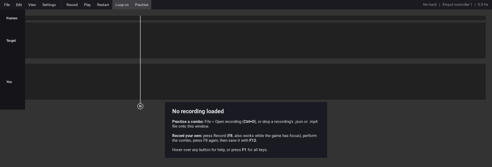
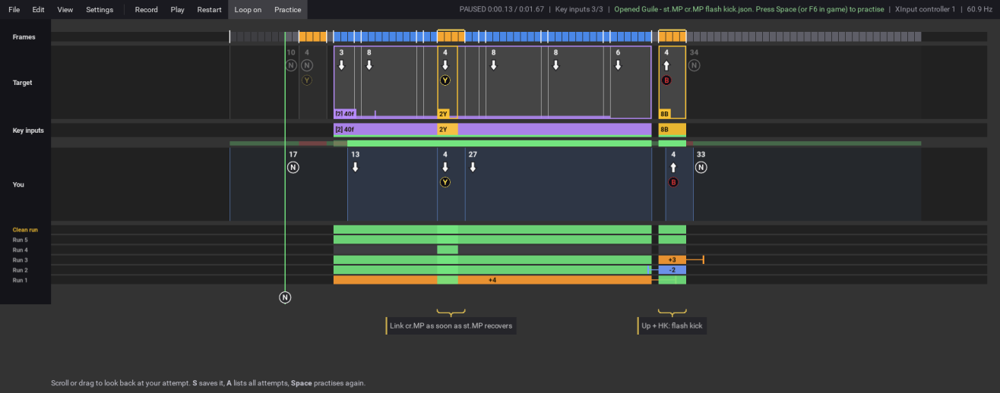
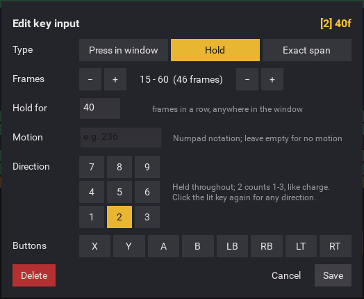
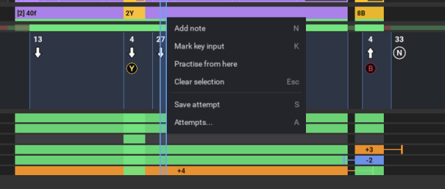
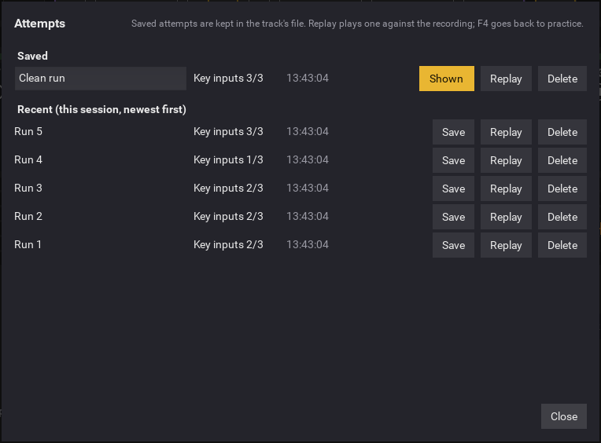

# Wombo Combo user guide

Wombo Combo records the inputs from your controller (and optionally the game on screen) while you
perform a combo. You then practise against that recording. The recording scrolls towards a line,
you press each input as it reaches the line, and the app shows exactly where your timing drifts.
Frame by frame, and attempt after attempt.

- [Quick start](#quick-start)
- [Sample combos](#sample-combos)
- [The screen](#the-screen)
- [Practising](#practising)
- [Recording your own combos](#recording-your-own-combos)
- [Marking what matters: key inputs](#marking-what-matters-key-inputs)
- [Notes](#notes)
- [Reviewing your attempts](#reviewing-your-attempts)
- [Saving, opening and files](#saving-opening-and-files)
- [Videos and overlay mode](#videos-and-overlay-mode)
- [Settings](#settings)
- [Keys and mouse reference](#keys-and-mouse-reference)
- [Troubleshooting](#troubleshooting)

## Quick start

Wombo Combo runs on Windows with an Xbox-style (XInput) controller. Other controllers are read
through SDL. To start the app:

```
pip install -r requirements.txt
python main.py
```

**To practise a combo someone recorded:**

1. Press **Ctrl+O** and pick the recording. Either its `.mp4` or its `.json` works. You can also
   drag the file onto the window.
2. Press **Space** in the app, or **F6** while the game has focus.
3. Press each input as it reaches the white line. The first inputs scroll in over a one-second
   lead-in, so you have time to get ready.

**To record your own:**

1. Press **F8**. This works while the game has focus.
2. Perform the combo.
3. Press **F8** again to stop.
4. Press **F12** to save it.

With nothing loaded, the app shows these steps too:



## Sample combos

The File menu has two Street Fighter 6 samples, ready to practise. They use the default Xbox
Classic layout (X = LP, **Y = MP**, RB = HP, A = LK, **B = MK**, RT = HK), with the character
facing right.

| Sample | Combo | What it shows |
|---|---|---|
| **SF6 Ryu** | st.MP, cr.MP, 214 MK (medium Tatsumaki) | **Link.** The cr.MP has a tight 3-frame window. **Special cancel.** A motion (`214`) buffered during cr.MP, then MK. **Ignoring noise.** The recording has a stray frame of down-forward, and its buttons are held longer than needed; neither is part of a key input, so neither is scored. |
| **SF6 Guile** | st.MP, cr.MP, [2] 8 MK (medium Flash Kick) | **Charge (a Hold key input).** Down must be held long enough for Flash Kick. Charging on the frame after st.MP is ideal (the purple bar), but you can start as late as the notch and still make it. |

Each sample comes with notes explaining it, and two saved example attempts so you can see how
runs are graded before playing. Ryu's late example shows a cr.MP two frames late (`+2`). Guile's
shows a charge started too late. Hide them from the attempts manager (**A**) once you've seen
them.

The samples were written by hand to be plausible, **not measured in the game**. The link and
cancel windows, and Guile's 36-frame charge, are placeholders. Check them against the game's frame
data (or your own recording) and adjust them by clicking a key input's tag. You can also change
the timeline in `samples/build_samples.py` and run it again.

## Where to find help in the app

You don't need to memorise anything in this guide. The app itself gives you:

- **The hint line** under the input list, which always says what to do next for what you're doing.
- **Tooltips** when you hover over any button on the menu bar for half a second.
- **F1**, which shows the getting-started steps and every key.
- **Menus** that show each item's shortcut next to it, including the right-click menu.

## The screen



**The menu bar** runs across the top:

| Item | What it does |
|---|---|
| File, Edit, View | Menus. |
| Settings | Opens the settings (see [Settings](#settings)). |
| Record / Stop | Starts and stops recording. |
| Play / Pause | Plays or pauses the recording. |
| Restart | Goes back to the first frame. |
| Loop on / Loop off | Whether playback repeats. |
| Practice / Review | Whether playing scores you or replays your last attempt. |

The status bar on the right shows:
- the mode (PRACTICE, REVIEW, PAUSED, GET READY or REC) and the time;
- your score;
- messages;
- the controller in use;
- the input sampling rate, which should read about 60 Hz.

**The input list** is where practice happens. Time runs left to right. Inputs slide leftwards and
reach the **white line** on the frame they should be pressed. It works like a rhythm game, but you
read it like text. From the top, the lanes are:

| Lane | What it shows |
|---|---|
| **Frames** | One block per frame of the recording: grey is neutral, blue a direction, orange a button. A white tick marks where the input changes. |
| **Target** | The recording. Each box is one input, as wide as it was held. Its label shows how many frames it lasts, the direction and the buttons. |
| **Key inputs** | Only what's required, once you've [marked key inputs](#marking-what-matters-key-inputs). |
| **You** | Your attempt, drawn the same way. The strip above it marks each frame green where you matched the recording and red where you didn't. |
| **Saved attempts / Recent attempts** | One compact, colour-coded row per earlier attempt (see [Reviewing your attempts](#reviewing-your-attempts)). |

Under the lanes, next to the line, is your controller's **live input** right now. The line turns
green while you're matching the recording. **Notes** hang below that, pointing at the frames they
describe. The **hint line** is at the bottom.

Every lane can be hidden from the **View** menu, which says whether each one is shown or hidden.

## Practising

| To | Do this |
|---|---|
| Play / pause | **Space** (in the app) or **F6** / **F7** (in game), or the Play button |
| Start over | **Home** (in the app) or **F5** (in game), or Restart |
| Practise one part | Right-click in the list and choose **Practise from here** |
| Look back | Scroll the mouse wheel (one frame per notch) or drag the list sideways |
| Zoom | **Ctrl+Wheel** |

- **Practice and Review.** In **Practice** mode, playing records your controller against the
  recording and scores it. In **Review** mode, playing replays your last attempt next to the
  recording, so you can watch where it went wrong. The button on the menu bar names the mode
  you're in. **F4** switches.
- **Lead-in.** When practice starts, and on every loop, the list scrolls in for a moment before
  the first frame (1 second by default). You can change or turn this off in
  [Settings](#settings).
- **Loop.** With **Loop on**, the recording repeats. Each pass starts fresh, and the pass you just
  finished is kept in [Recent attempts](#reviewing-your-attempts).

## Recording your own combos

1. If you want the game's video as well as your inputs, check **Settings**: *Record video* is on,
   and *Capture display* is the screen the game is on.
2. Get into position in the game, then press **F8** (it works while the game has focus). The status
   bar shows **REC** and the time.
3. Perform the combo, then press **F8** again. If video was recorded, the status bar shows
   "Finishing video" for a moment.
4. Press **F12** (File > Save recording as...) and choose a name. This saves:
   - `name.json`: your inputs, plus any notes, key inputs and saved attempts;
   - `name.mp4`: the video, if it was recorded;
   - `name_overlay.mp4`: the video with your inputs drawn over it, if *Export overlay on save* is
     on.

Recording again replaces the current take. If you've added notes or key inputs that aren't saved,
the app asks first.

Recordings usually contain things you didn't mean: a stray button, a direction held a bit too
long. Rather than editing those out, mark what actually matters, as described in the next section.

**Edit > Clean track (presses only)** reduces every held button to the frame it was pressed. This
is occasionally useful, but it changes the recording, so it's at the bottom of the menu.

## Marking what matters: key inputs

A **key input** says what must be done, and in which frames. Once a recording has key inputs:
- only they are scored;
- everything else (stray presses, over-held directions) fades into the background;
- each key input shows as a hit or a miss.

### Marking one

1. Select the frames where the input may happen. Drag in the **Frames** lane (or the Key inputs
   lane), or click a frame and **Shift+click** another.
2. Press **K** (or right-click > Mark key input).
3. The editor opens with a guess taken from the recording. Check it, trim anything stray, and
   press **Save**.

To change a key input later, click its tag or its block in the Key inputs lane.



The editor's top-right corner shows the requirement in numpad notation, which is described below.

### The three types

| Type | Colour | Passes when | Example |
|---|---|---|---|
| **Press in window** | Gold | The motion, direction and buttons are done on any frame in the window. At least one of the buttons must be newly pressed. | `236X` (quarter-circle forward + X), `6X`, `A+B` |
| **Hold** | Purple | The direction or buttons are held for at least *N* frames in a row, anywhere in the window. | `[2] 40f`: hold down for 40 frames to charge |
| **Exact span** | Cyan | Every frame in the window matches the recording exactly. | `EXACT 3f`: a 3-frame micro-walk |

- **Motion** is typed in numpad notation. Extra directions in between are allowed, as in most
  games, so a sloppy `2 1 2 3 6` still counts as `236`. Leave it empty for no motion.
- **Direction** is the direction held when the button is pressed. Click the lit key again for "any
  direction". For a **Hold**, directions work like charge: `2` accepts down-back, down and
  down-forward.
- **Buttons** are toggles. Click one to drop a stray button the recording picked up.
- **Hold for** is how many frames in a row a Hold needs. Switching to Hold fills this in with the
  direction the recording holds longest and how long it's held.

**Holds and charge.** Make the window cover every frame the charge is allowed in, from right after
the first attack until the special, and set *Hold for* to the charge time. A purple bar shows the
ideal charge, starting on the window's first frame. A small notch marks the last frame you can
start charging and still make it. After an attempt, the bright part of the result bar shows the
charge you actually held, so a late start shows up as a gap.

**Exact spans.** Only the frames in the window are checked. To enforce "walk for exactly 3
frames", include the neutral frame on each side of the walk in the selection.

### Numpad notation

```
7 8 9      up-back    up    up-forward
4 5 6      back     neutral   forward
1 2 3      down-back  down  down-forward
```

These assume your character is facing right: `236` is down, down-forward, forward (a
quarter-circle forward), and `[2]` means hold down.

## Notes

Select some frames and press **N** (or right-click > Add note) to attach a note, for example
"hit-confirm here". A note shows as a small card under the list. A brace points at its frames,
and a yellow bar sits over them.

- To edit or delete a note, click it.
- **Shift+F3** (View > Hide notes) hides the cards but keeps the yellow bars, once you know them.
- Notes are included in exported videos. Each one appears half a second before its frames
  and stays up for a second after them.

## Reviewing your attempts



**Recent attempts.** Every practice pass is kept as a run. That happens when playback loops or
reaches the end, or when you restart partway. Abandoned attempts count too, since they show where
things fall apart. The newest runs are shown as compact rows under your attempt. Each key input is
coloured by how that run did:

| Colour | Meaning |
|---|---|
| Green | Hit |
| Blue | Early: done before the window. Shows how many frames early, e.g. `-2`. |
| Orange | Late: done after the window. Shows how many frames late, e.g. `+3`. |
| Red | Missed |
| Grey | Not reached; that run stopped before this point |

For early and late inputs, a tick marks the frame where you actually did it. Reading down the rows
shows habits at a glance, like a link that's always a frame late. Early and late are looked for up
to 12 frames outside the window, and never inside a neighbouring key input's window. Without any
key inputs, each row shows per-frame matches instead.

*Settings > Recent attempts shown* sets how many rows appear. Recent runs are kept for the session
(up to 50 per recording) and cleared when you open another recording.

**Saving attempts.** Press **S** to keep the attempt on screen with the recording. If there's
nothing on screen, it keeps the latest run instead. Saved attempts get their own rows with gold
names, above the recent ones. They're stored in the recording's `.json`, and if the recording has
already been saved, the file is updated immediately.

**The attempts manager.** Press **A** (or Edit > Attempts...) to see every saved and recent
attempt with its score and time. From here you can:
- **rename** a saved attempt by typing in its name;
- **Show / Hide** a saved attempt in the input list;
- **Save** a recent run;
- **Replay** any attempt next to the recording. This switches to Review; **F4** goes back to
  practice.
- **Delete** an attempt. This takes a second click to confirm.



Changing key inputs re-grades every run, so older attempts are always judged by the current
requirements.

## Saving, opening and files

| To | Do this |
|---|---|
| Open a recording | **Ctrl+O** / **F11** / File > Open recording, or drop its `.json` or `.mp4` on the window |
| Reopen a recent one | Pick it under Open in the File menu (the last five are listed) |
| Save changes | **Ctrl+S** (File > Save) writes notes, key inputs and attempts into the recording's `.json` |
| Save a new take | **F12** (File > Save recording as...), which also saves its video |

The status bar shows **Unsaved** when there are changes to save. Opening another recording,
clearing the track or quitting asks first: **Yes** saves, **No** discards, **Cancel** stops.

Opening a recording always takes you straight to practice: the input list, Practice mode, first
frame. The window title shows the recording's name.

## Videos and overlay mode

- **File > Export overlay video...** saves the recording's video with the inputs (and notes) drawn
  over it. The recording must have video.
- **File > Export input video...** saves just the inputs as a video.
- *Settings > Overlay input delay* shifts the drawn inputs later by a few frames to line up with
  the game's own input lag in the video.

**Overlay mode (F2)** keeps Wombo Combo on top of the game, borderless and see-through, so you can
practise with the input list over the game itself. Set how see-through it is with *Overlay
opacity* in the View menu. **F3** switches to the older ring display, if you prefer it.

## Settings

| Setting | What it does |
|---|---|
| Controller | Which controller to read (default: the first connected). |
| Record video | Capture the screen while recording inputs. |
| Capture display | Which screen to capture. |
| Video size | Scale captured video down to 1080p or 720p, or keep the native size. |
| Encoder | Video encoder: Auto, CPU (x264) or NVIDIA (NVENC). |
| Overlay input delay | Frames to delay drawn inputs in overlay videos. |
| Export overlay on save | Also write `name_overlay.mp4` when saving a recording. |
| Lead-in before practice | The run-up before practice playback: off, 0.5 s, 1 s or 2 s. |
| Recent attempts shown | How many recent runs appear as rows. |

Settings are saved automatically.

## Keys and mouse reference

**In game.** These work even while the game window has focus:

| Key | Action |
|---|---|
| F1 | Help and keys |
| F2 | Overlay mode |
| F3 | Switch between the input list and the ring display |
| Shift+F3 | Show / hide notes |
| F4 | Practice / Review |
| F5 | Restart |
| F6 / F7 | Play / Pause |
| F8 | Start / stop recording |
| F11 | Open a recording |
| F12 | Save recording as |

**In the app window:**

| Key | Action |
|---|---|
| Space | Play / pause |
| Home | Restart (a fresh attempt while practising) |
| Ctrl+O / Ctrl+S | Open / save |
| N | Add a note to the selection |
| K | Mark the selection as a key input |
| S | Save the attempt |
| A | Attempts manager |
| Esc | Clear the selection |

**Mouse, in the input list:**

| Action | Does |
|---|---|
| Wheel / drag sideways | Move through the recording, one frame per wheel notch |
| Ctrl+Wheel | Zoom |
| Click / Shift+click | Select a frame / extend the selection |
| Drag in Frames (or Key inputs) | Select a range of frames |
| Right-click | Menu for the selection |
| Click a note or key input tag | Edit it |

## Troubleshooting

- **"No controller" in the status bar.** Plug the controller in; the app checks every second. If
  you have several, pick one in *Settings > Controller*.
- **The F-keys don't work in game.** If the game runs as administrator, run Wombo Combo as
  administrator too. Windows doesn't pass keys from an elevated window to non-elevated apps.
- **"late frames" while recording, or the rate isn't about 60 Hz.** The PC is too busy to sample
  every frame on time. Close heavy programs, or turn off *Record video* or lower *Video size*.
- **Video capture failed.** The recording continues with inputs only, and the message says why.
  Try *Settings > Encoder: CPU (x264)*.
- **"No inputs for that video".** A recording's `.mp4` can only be opened next to its `.json` with
  the same name. Keep the two files together.
- **Settings file.** Settings are kept in `%APPDATA%\wombocombo\wombocombo.ini`. Deleting it
  restores the defaults.
